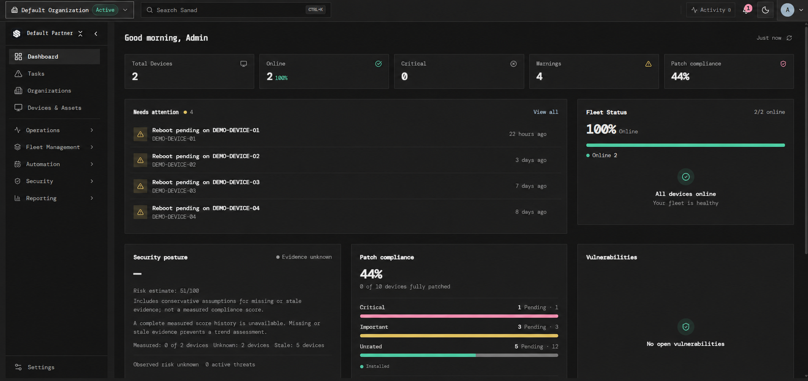
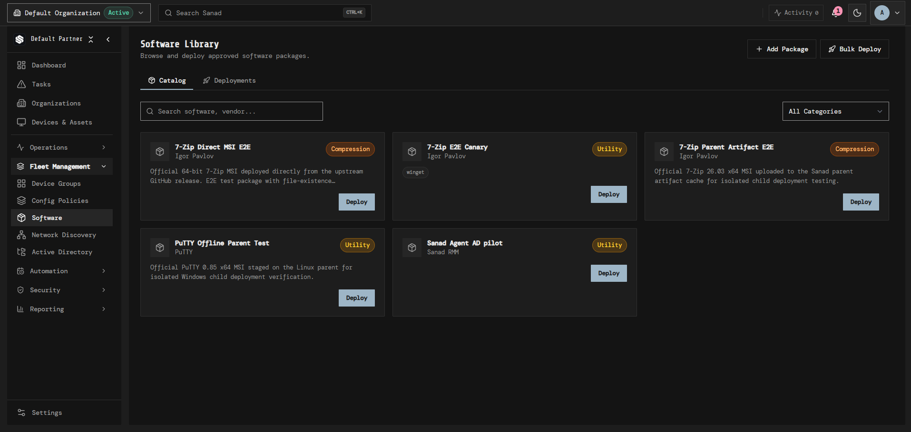
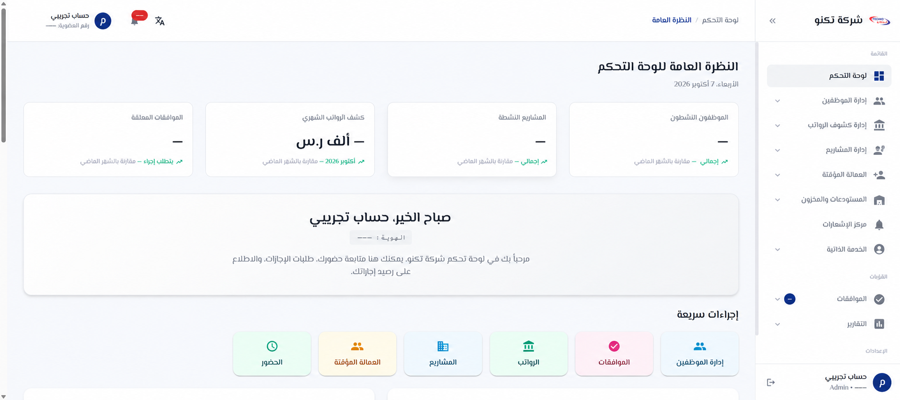
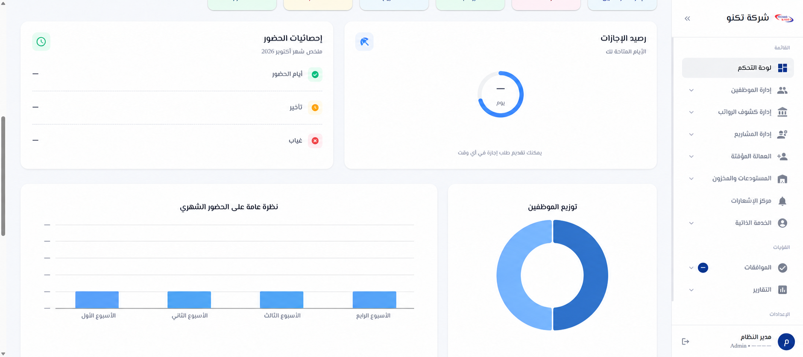

<picture><source media="(max-width: 640px)" srcset="assets/profile-hero-mobile.svg"></picture>

I build web products across React/Next.js, TypeScript, Python, and Java—usually working from the interface through the API and database. The projects below show my work on live products, team systems, and portfolio demos. Client and team code is not published here.

[Portfolio](https://solstudio.me) · [LinkedIn](https://www.linkedin.com/in/momenalmohtaseb) · [Email](mailto:momen.almo7taseb@gmail.com)

## Selected work

### VocTap — learn English from what you watch

VocTap turns words and phrases in videos and web pages into explanations you can save and review later. I work across the Chrome extension, learner dashboard, backend, and bilingual website with my co-founder. The product uses TypeScript, React/Next.js, Cloudflare Workers, and D1.

[Visit VocTap](https://voctap.com) · [Watch a short product demo](https://voctap.com/voctap-hero-demo.mp4) · Source is private

### Sanad Engine — IT operations platform

Sanad brings device monitoring, software deployment, patching, and IT workflows into one product. On the engineering team, I worked on the dashboard and design system, Active Directory integration, and Windows agent lifecycle. My contributions span the web interface and backend workflows; this is a team product, not a solo project.

[Visit Sanad](https://sanad.f9.sa/) · Team source code is not published here

Development preview; device names have been anonymized.

See the software library

 

### Techno ERP — operations at workforce scale

Techno ERP is a live, multi-tenant platform used to run HR, project, payroll, accounting, and inventory workflows for a Saudi business with a large workforce. I was one of three core engineers building the product from the ground up, working end to end on key modules rather than just the interface. One example is GPS attendance: each project has a configured radius, and a worker can check in only when their location is inside it. The stack is Next.js, Spring Boot, and PostgreSQL.

[Visit Techno ERP](https://www.techno-erp.com/) · Client source code is private

Illustrative, privacy-sanitized preview based on the live interface. Click to enlarge. Account identifiers and operational metrics are removed; no client records or source code are shared.

See the attendance and analytics view

 

### Lexxi Medical — speech to editable medical notes

An Arabic/English workflow for recording or uploading a consultation, transcribing it, and turning it into an editable structured note. I built the original client version with React, FastAPI, Whisper, and an LLM API; this separate portfolio demo uses Next.js and TypeScript. The public demo is for synthetic/sample information only, not real patient data.

[Portfolio demo](https://lexxi.vercel.app) · Source is private

### E-commerce storefront and operations dashboard

Built a customer storefront and an operations dashboard for catalog, inventory, orders, and checkout. The project uses Next.js, TypeScript, Supabase/PostgreSQL, and Playwright end-to-end tests. The storefront is public; its source and admin area are not.

[View the storefront](https://leaderperfumes.com/)

### Learning management system

A React/TypeScript course-management demo with student and admin flows, role-based routes, assessments, and progress tracking. This public version uses local mock data rather than a production backend.

[Live demo](https://lms-omega-gray.vercel.app) · [Public source](https://github.com/Mo7taseb/LMS)

## Other engineering work

- **Skycore Cloud:** worked on a self-hosted endpoint-management product using Next.js, FastAPI, and PostgreSQL, including remote-access workflows and access control. This product is still in development and testing.

I can explain my contributions and technical decisions without sharing client or team code.

## Technologies I use

- **Frontend:** React, Next.js, TypeScript, Tailwind CSS
- **Backend:** Python, FastAPI, Django, Java, Spring Boot, TypeScript APIs
- **Data and delivery:** PostgreSQL, Supabase, Cloudflare D1, Docker, GitHub Actions, Playwright
