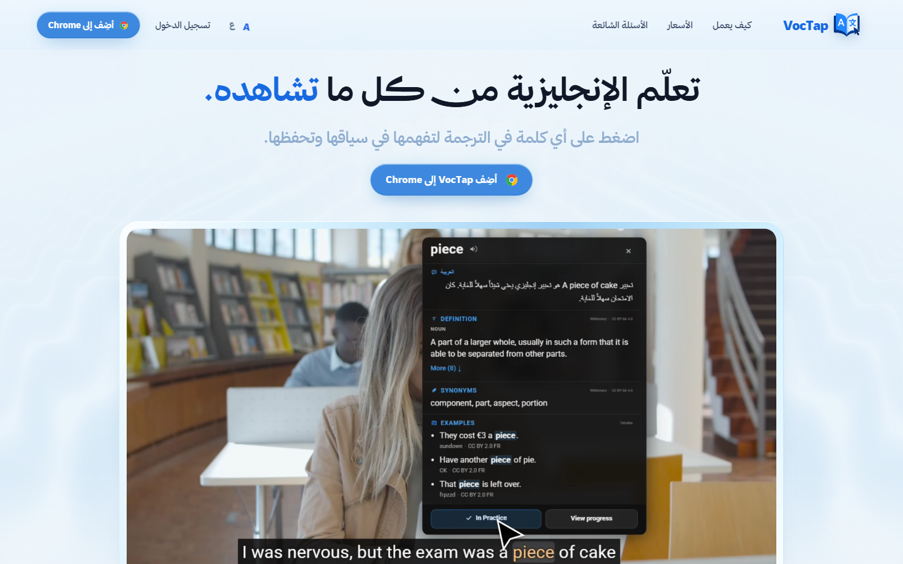
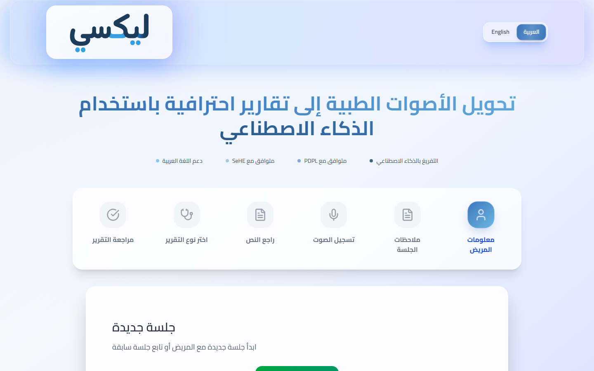
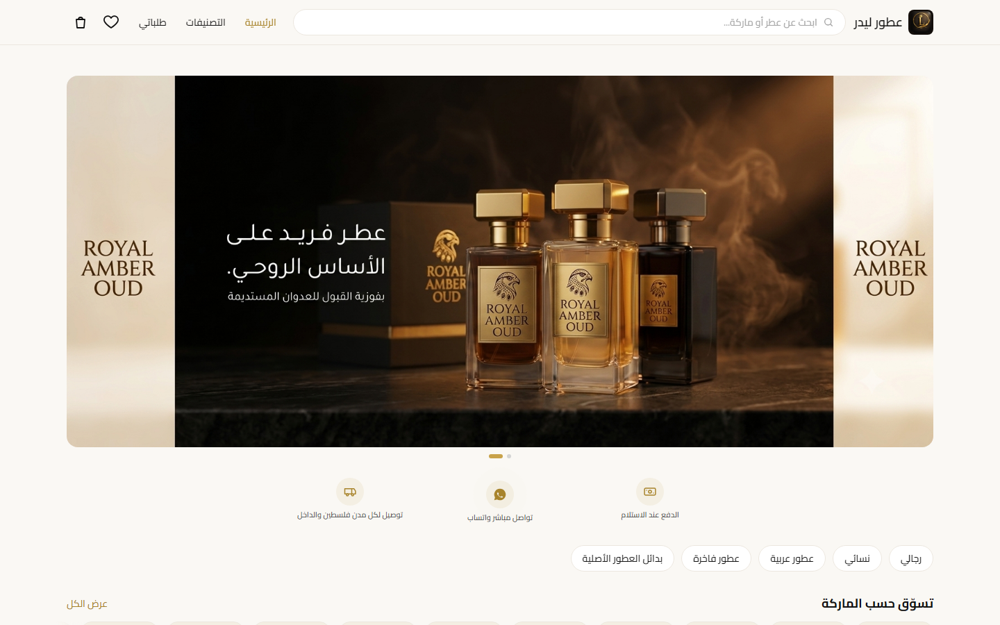

<picture><source media="(max-width: 640px)" srcset="assets/profile-hero-mobile.svg"></picture>

I build web products across React/Next.js, TypeScript, Python, and Java—usually working from the interface through the API and database. The projects below show what I built, what is live, and which source repositories are private.

[Portfolio](https://solstudio.me) · [LinkedIn](https://www.linkedin.com/in/momenalmohtaseb) · [Email](mailto:momen.almo7taseb@gmail.com)

## Selected work

### VocTap — learn English from what you watch

VocTap turns words and phrases in videos and web pages into explanations you can save and review later. I work across the Chrome extension, learner dashboard, backend, and bilingual website with my co-founder. The product uses TypeScript, React/Next.js, Cloudflare Workers, and D1.

[Visit VocTap](https://voctap.com) · [Watch a short product demo](https://voctap.com/voctap-hero-demo.mp4) · Source is private

### Lexxi Medical — speech to editable medical notes

An Arabic/English workflow for recording or uploading a consultation, transcribing it, and turning it into an editable structured note. I built the original client version with React, FastAPI, Whisper, and an LLM API; this separate portfolio demo uses Next.js and TypeScript. The public demo is for synthetic/sample information only, not real patient data.

[Portfolio demo](https://lexxi.vercel.app) · Source is private

### E-commerce storefront and operations dashboard

Built a customer storefront and an operations dashboard for catalog, inventory, orders, and checkout. The project uses Next.js, TypeScript, Supabase/PostgreSQL, and Playwright end-to-end tests. The storefront is public; its source and admin area are not.

[View the storefront](https://ecomm-orcin-six.vercel.app)

### Learning management system

A React/TypeScript course-management demo with student and admin flows, role-based routes, assessments, and progress tracking. This public version uses local mock data rather than a production backend.

[Live demo](https://lms-omega-gray.vercel.app) · [Public source](https://github.com/Mo7taseb/LMS)

## Other engineering work

- **Techno ERP:** worked on a multi-tenant business system spanning HR, GPS-radius attendance, inventory, and role-based access using Next.js, Spring Boot, and PostgreSQL.
- **Skycore Cloud:** worked on a self-hosted endpoint-management product using Next.js, FastAPI, and PostgreSQL, including remote-access workflows and access control. This product is still in development and testing.

These product repositories are private. I can explain my contributions and technical decisions without sharing client or team code.

## Technologies I use

- **Frontend:** React, Next.js, TypeScript, Tailwind CSS
- **Backend:** Python, FastAPI, Django, Java, Spring Boot, TypeScript APIs
- **Data and delivery:** PostgreSQL, Supabase, Cloudflare D1, Docker, GitHub Actions, Playwright
